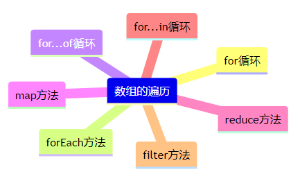

## 遍历操作

### for循环
```
for(initialExpression;终止条件;incrementExpression)
```
### forEach

```
const arr = [1, 2, 3, 4];
let res = arr.forEach((item) => item * 2);
console.log(arr);
console.log(res);//undefined
```

forEach方法不会改变原始数组，但**也不会创建新的数组**！！！！
### for...of循环
for...of循环是ES6新增的一种循环语法，它可以用于遍历**数组**、**字符串**、**Map**、**Set**等可迭代对象。与传统的for循环不同，for...of循环语句本身不包含初始化变量、循环条件和迭代器，而是**直接遍历迭代对象中的每个元素**。
```
let array = [1,2,3,4,5]

for(let item of array){
    console.loh(item)
}
```
需要注意的是，for...of循环只能用于遍历可迭代对象，不能用于普通对象。如果需要遍历对象的属性，可以使用for...in循环。
### map
略
### for...in循环
for...in循环是JavaScript中用于遍历对象属性的一种循环语句。与传统的for循环语句类似，for...in循环也需要指定一个迭代变量和一个可枚举对象。在每次迭代中，迭代变量会被赋值为可枚举对象的下一个属性名，然后我们就可以使用该属性名来访问对应的属性值。
```
let obj = {
  name: "lqy",
  age: 23,
};
for (let prop in obj) {
  console.log(prop + ":" + obj[prop]);
}
```
其在遍历数组时，迭代变量被赋值为数组下标
```
let arr = [0, 1, 2, 3];
for (let index in arr) {
  console.log(arr[index]);
}
```
